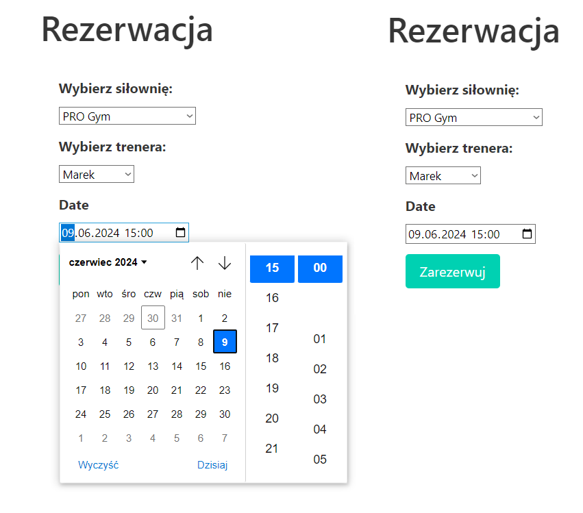
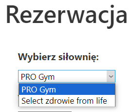

# Imiona i nazwiska autorów:
### Maciej Wilewski
### Dawid Mularczyk

## Opis projektu Klub 100 kilo:
Projekt polega na stworzeniu prostej aplikacji webowej słuzącej do zarządzania treningami na siłowni.
Użytkownik ma mozliwość zarezerwować daną siłownię z naszej bazy danych oraz renera o ile jedno i druie są dostępne.


## Schemat bazy danych i opis tabeli:


### Tabela: Users
Przechowuje informacje o użytkownikach.

| Kolumna       | Typ         | Opis                        |
|---------------|-------------|-----------------------------|
| user_ID       | SERIAL      | Klucz główny                |
| first_name    | varchar(50) | Imię użytkownika            |
| last_name     | varchar(50) | Nazwisko użytkownika        |
| mail          | varchar(100)| Email użytkownika           |
| phone_number  | int         | Numer telefonu użytkownika  |
| password      | varchar(100)| Hasło użytkownika           |

### Tabela: Trainers
Przechowuje informacje o trenerach.

| Kolumna       | Typ         | Opis                        |
|---------------|-------------|-----------------------------|
| trainer_ID    | SERIAL      | Klucz główny                |
| first_name    | varchar(50) | Imię trenera                |
| last_name     | varchar(50) | Nazwisko trenera            |
| hourly_cost   | int         | Koszt godzinny trenera      |
| specialization| varchar(40) | Specjalizacja trenera       |
| description   | varchar(400)| Opis trenera                |

### Tabela: Gyms
Przechowuje informacje o siłowniach.

| Kolumna       | Typ          | Opis                    |
|---------------|--------------|-------------------------|
| gym_ID        | SERIAL       | Klucz główny            |
| name          | varchar(80)  | Nazwa siłowni           |
| phone_number  | int          | Numer telefonu siłowni  |
| address       | varchar(80)  | Adres siłowni           |
| limit         | int          | Limit miejsc w siłowni  |

### Tabela: Reservations
Przechowuje informacje o rezerwacjach.

| Kolumna        | Typ        | Opis                                           |
|----------------|------------|------------------------------------------------|
| reservation_ID | SERIAL     | Klucz główny                                   |
| user_ID        | int        | Klucz obcy do tabeli Users                     |
| gym_ID         | int        | Klucz obcy do tabeli Gyms                      |
| trainer_ID     | int        | Klucz obcy do tabeli Trainers                  |
| status         | varchar(1) | Status rezerwacji                              |
| date           | timestamp  | Data rezerwacji (każdy trening trwa 2 godziny) |

### Tabela: Logs
Przechowuje logi zmian rezerwacji.

| Kolumna         | Typ    | Opis                              |
|-----------------|--------|-----------------------------------|
| log_ID          | SERIAL | Klucz główny                      |
| reservation_ID  | int    | Klucz obcy do tabeli Reservations |
| status          | int    | Status rezerwacji                 |
| trainer_id      | int    | Przypisany nowy trener            |
| log_date        | date   | Data logu                         |


## Proste operacje CRUD
### Create na przykładzie add_reservation:
```sql
create procedure add_reservation(IN p_user_id integer, IN p_gym_id integer, IN p_date timestamp without time zone, IN p_trainer_id integer DEFAULT NULL::integer)
    language plpgsql
as
$$
BEGIN
    INSERT INTO Reservations (user_ID, gym_ID, trainer_ID, status, date)
    VALUES (p_user_ID, p_gym_ID, p_trainer_ID, 'A', p_date);
    RAISE NOTICE 'Reservation added successfully.';
END;
$$;

alter procedure add_reservation(integer, integer, timestamp, integer) owner to postgres;
```

```python
class AddReservationAPIView(APIView):
    serializer_class = ReservationSerializer

    @swagger_auto_schema(request_body=ReservationSerializer)
    def post(self, request, *args, **kwargs):
        request_data = request.data.copy()

        if request_data.get('trainer_ID') == 0:
            request_data['trainer_ID'] = None

        serializer = self.serializer_class(data=request_data)
        if serializer.is_valid():
            data = serializer.validated_data
            with connection.cursor() as cursor:
                try:
                    date_without_tz = data['date'].strftime('%Y-%m-%d %H:%M:%S')

                    cursor.execute("CALL add_reservation(%s, %s, %s, %s)", [
                        data['user_ID'],
                        data['gym_ID'],
                        date_without_tz,
                        data['trainer_ID'],
                    ])

                    return Response({'message': 'Reservation added successfully'}, status=status.HTTP_201_CREATED)
                except Exception as e:
                    return Response({'error': str(e)}, status=status.HTTP_400_BAD_REQUEST)
        else:
            return Response(serializer.errors, status=status.HTTP_400_BAD_REQUEST)

```

```python
class ReservationSerializer(serializers.Serializer):
    reservation_ID = serializers.IntegerField(read_only=True)
    user_ID = serializers.IntegerField()
    gym_ID = serializers.IntegerField()
    trainer_ID = serializers.IntegerField(allow_null=True, required=False, default=None)
    status = serializers.CharField(max_length=1, default='A')
    date = serializers.DateTimeField()
```

```python
urlpatterns = [
    path('api/reservation/add_reservation/', AddReservationAPIView.as_view(), name='api_add_reservation'),
    path("new_reservation/", new_reservation_view, name="new_reservation"),
]
```

```python
class ReservationForm(forms.Form):
    user_ID = forms.IntegerField(widget=forms.HiddenInput())
    gym_ID = forms.ChoiceField(choices=get_gyms, label="Wybierz siłownię:")
    trainer_ID = forms.ChoiceField(choices=get_trainers, required=False, label="Wybierz trenera:")
    date = forms.DateTimeField(
        input_formats=['%Y-%m-%dT%H:%M:%S.%fZ'],
        widget=forms.DateTimeInput(attrs={'type': 'datetime-local'})
    )

    def clean_trainer_ID(self):
        trainer_id = self.cleaned_data.get('trainer_ID')
        return 0 if trainer_id == '0' else trainer_id
```

```python
def new_reservation_view(request):
    user_id = request.COOKIES.get('user_id')
    if user_id is None:
        return redirect('login')
    else:
        if request.method == 'POST':
            form = ReservationForm(request.POST)
            if form.is_valid():
                data = {
                    'user_ID': form.cleaned_data['user_ID'],
                    'gym_ID': form.cleaned_data['gym_ID'],
                    'trainer_ID': form.cleaned_data['trainer_ID'],
                    'date': form.cleaned_data['date'].strftime('%Y-%m-%dT%H:%M:%S.%fZ'),
                }
                api_url = request.build_absolute_uri(reverse('api_add_reservation'))
                response = requests.post(api_url, json=data)
                if response.status_code != 201:
                    print(f"API request failed with status code {response.status_code}")
        else:
            form = ReservationForm(initial={'user_ID': user_id})
        return render(request, "new_reservation.html", {'form': form})
```

```html
<link rel="stylesheet" href="../static/styles/new_reservation.css" />
<section class="section">
  <div class="container">
      <h2 class="title is-2">Rezerwacja</h2>
      <form method="post">
        
        <div class="field">
          <div class="control">
            {{ form.user_ID }}
          </div>
        </div>
        <div class="field">
          <label class="label">{{ form.gym_ID.label }}</label>
          <div class="control">
            {{ form.gym_ID }}
          </div>
        </div>
        <div class="field">
          <label class="label">{{ form.trainer_ID.label }}</label>
          <div class="control">
            {{ form.trainer_ID }}
          </div>
        </div>
        <div class="field">
          <label class="label">{{ form.date.label }}</label>
          <div class="control">
            {{ form.date }}
          </div>
        </div>
        <div class="field">
          <div class="control">
            <button type="submit" class="button is-primary">Zarezerwuj</button>
          </div>
        </div>
      </form>
  </div>
</section>
```



### Read na przykładzie get_gyms:
```python
def get_gyms():
    with connection.cursor() as cursor:
        cursor.execute("SELECT gym_ID, name FROM gyms")
        return cursor.fetchall()
```

```python
class ReservationForm(forms.Form):
    --- reszta kodu ---
    gym_ID = forms.ChoiceField(choices=get_gyms, label="Wybierz siłownię:")
    --- reszta kodu ---
```




### Update na przykładzie cancel_reservation:
```sql
create procedure cancel_reservation(IN p_reservation_id integer)
    language plpgsql
as
$$
BEGIN
    UPDATE Reservations
    SET status = 'C'
    WHERE reservation_ID = p_reservation_ID;
    RAISE NOTICE 'Reservation cancelled successfully.';
END;
$$;

alter procedure cancel_reservation(integer) owner to postgres;
```

```python
class CancelReservationAPIView(APIView):
    serializer_class = UpdateReservationSerializer

    @swagger_auto_schema(manual_parameters=[
        openapi.Parameter('reservation_id', openapi.IN_PATH, description="Reservation ID", type=openapi.TYPE_INTEGER)
    ])
    def put(self, request, reservation_id, *args, **kwargs):
        with connection.cursor() as cursor:
            try:
                # Call the stored procedure
                cursor.execute("CALL cancel_reservation(%s)", [reservation_id])
                return Response({'message': 'Reservation cancelled successfully'}, status=status.HTTP_200_OK)
            except Exception as e:
                # If an error occurs, return a 400 error with detailed message
                return Response({'error': 'An error occurred: {}'.format(e)}, status=status.HTTP_400_BAD_REQUEST)
```

```python
class UpdateReservationSerializer(serializers.Serializer):
    reservation_ID = serializers.IntegerField(read_only=True)
    user_ID = serializers.IntegerField(read_only=True)
    gym_ID = serializers.IntegerField(read_only=True)
    trainer_ID = serializers.IntegerField(allow_null=True, required=False, default=None)
    status = serializers.CharField(max_length=1, default='A')
    date = serializers.DateTimeField(read_only=True)
```

```python
urlpatterns = [
    path('api/reservation/cancel_reservation/<int:reservation_id>/', CancelReservationAPIView.as_view(),name='api_cancel_reservation'),
    path("modify_reservation/", modify_reservation_view, name="modify_reservation"),
]
```

```python
class ModifyReservationForm(forms.Form):
    reservation_id = forms.IntegerField(widget=forms.HiddenInput())
    trainer_ID = forms.ChoiceField(choices=[], required=False, label="Wybierz trenera:")

    def clean_trainer_ID(self):
        trainer_id = self.cleaned_data.get('trainer_ID')
        return 0 if trainer_id == '0' else trainer_id

    def __init__(self, *args, **kwargs):
        super(ModifyReservationForm, self).__init__(*args, **kwargs)
        self.fields['trainer_ID'].choices = get_trainers()
```

```python
def modify_reservation_view(request):
    user_id = request.COOKIES.get('user_id')
    if user_id is None:
        return redirect('login')

    # Fetch gym names using SQL query
    reservations_with_gym_names = {}
    with connection.cursor() as cursor:
        cursor.execute("""
            SELECT r.reservation_ID, g.name AS gym_name
            FROM reservations r
            INNER JOIN gyms g ON r.gym_ID = g.gym_ID
            WHERE r.user_ID = %s AND r.status = 'A'
        """, [user_id])
        for row in cursor.fetchall():
            reservation_id, gym_name = row
            reservations_with_gym_names[reservation_id] = gym_name

    # Fetch active reservations for the logged-in user using API
    api_url = request.build_absolute_uri(reverse('get_reservations', args=[user_id]))
    response = requests.get(api_url)
    reservations = []
    if response.status_code == 200:
        for res in response.json():
            if res['status'] == 'A':
                # Update each reservation with the gym name
                res['gym_name'] = reservations_with_gym_names.get(res['reservation_id'], 'Unknown Gym')
                reservations.append(res)
    else:
        print(f"API request failed with status code {response.status_code}")

    form = ModifyReservationForm()

    form.fields['trainer_ID'].choices = get_trainers()

    return render(request, "modify_reservation.html", {'active_reservations': reservations, 'form': form})
```

```html
<section class="section">
  <div class="container">
    <table class="table is-fullwidth is-striped is-hoverable">
      <thead>
        <tr>
          <th>Gym</th>
          <th>Trainer</th>
          <th>Date and Time</th>
          <th>Add/Change Trainer</th>
        </tr>
      </thead>
      <tbody>
        
        <tr>
          <td>{{ reservation.gym_name }}</td>
          <td>{{ reservation.trainer_id }}</td>
          <td>{{ reservation.date }}</td>
          <td>
            --- reszta kodu ---
            <form method="post" action="">
              
              <input type="hidden" name="reservation_id" value="{{ reservation.reservation_id }}">
              <button class="button is-danger inline-button" type="submit" name="cancel">Cancel Reservation</button>
            </form>
          </td>
        </tr>
        
      </tbody>
    </table>
  </div>
</section>
```

#TODO: Graficzny przykład anulowania rezerwacji

## Operacja o charakterze transakcyjnym
### Przykład transakcji na przykładzie add_reservation:

Kod i przykład zaprezentowany w sekcji Create.
Przy tworeniu i modyfikowaniu rezerwacji uruchamiane są triggery, które zarządzają naszymi zasobami.
Każda siłownia ma nadany limit osób, które mogą mieć rezerwacje w danym czasie, trenerzy mogą zajmować się tylko jedną osobą w danym czasie.
Zarówno siłowine jak i trenerzy pracują 24/7. Trenerzy pracują na każdej siłownii.

#### Funkcja do sprawdzania dostępności trenera:
```sql
create function check_trainer_availability(p_trainer_id integer, p_date timestamp without time zone) returns boolean
    language plpgsql
as
$$
DECLARE
    v_reservations INT;
BEGIN
    SELECT COUNT(*) INTO v_reservations
    FROM Reservations
    WHERE trainer_ID = p_trainer_ID
    AND status = 'A'
    AND NOT (date  + INTERVAL '2 hours' <= p_date OR date >= p_date + INTERVAL '2 hours');

    RETURN v_reservations = 0;
END;
$$;

alter function check_trainer_availability(integer, timestamp) owner to postgres;
```

#### Funkcja do sprawdzania dostępności siłowni:
```sql
create function check_gym_availability(p_gym_id integer, p_date timestamp without time zone) returns boolean
    language plpgsql
as
$$
DECLARE
    v_limit INT;
    v_reservations INT;
BEGIN
    SELECT "limit" INTO v_limit FROM Gyms WHERE gym_ID = p_gym_ID;
    SELECT COUNT(*) INTO v_reservations FROM Reservations WHERE gym_ID = p_gym_ID AND NOT (date  + INTERVAL '2 hours' <= p_date OR date >= p_date + INTERVAL '2 hours') AND status = 'A';
    RETURN v_reservations < v_limit;
END;
$$;

alter function check_gym_availability(integer, timestamp) owner to postgres;
```

#### Trigger wykorzystujący poprzednie funkcje:
```sql
    create function reservation_trigger() returns trigger
    language plpgsql
as
$$
BEGIN
    IF NEW.status = 'A' THEN
        IF NOT check_gym_availability(NEW.gym_ID, NEW.date) THEN
            RAISE EXCEPTION 'The gym is fully booked at the selected time.';
        END IF;
        IF NEW.trainer_ID IS NOT NULL AND NOT check_trainer_availability(NEW.trainer_ID, NEW.date) THEN
            RAISE EXCEPTION 'The trainer is not available at the selected time.';
        END IF;
    END IF;
    RETURN NEW;
END;
$$;

alter function reservation_trigger() owner to postgres;
```

#### Trigger, zapisujący zmiany w naszych rezerwacjach:
```sql
create function log_reservation_changes() returns trigger
    language plpgsql
as
$$
BEGIN
    INSERT INTO logs (reservation_id, status, trainer_id, log_date)
    VALUES (NEW.reservation_id, NEW.status, NEW.trainer_id, CURRENT_TIMESTAMP);
    RETURN NEW;
END;
$$;

alter function log_reservation_changes() owner to postgres;
```

#TODO: pokazać to graficznie

## Operacje o charakterze raportującym
### Przykład raportu na przykładzie monthly_trainer_earnings:
```sql
CREATE OR REPLACE VIEW monthly_trainer_earnings AS
SELECT
    t.trainer_id,
    t.first_name,
    t.last_name,
    COUNT(r.reservation_id) * t.hourly_cost * 2 AS monthly_earnings
FROM
    Trainers t
JOIN
    Reservations r ON t.trainer_id = r.trainer_id
WHERE
    r.status = 'A' AND r.date BETWEEN (CURRENT_DATE - INTERVAL '1 month') AND CURRENT_DATE
GROUP BY
    t.trainer_id, t.first_name, t.last_name;
```

